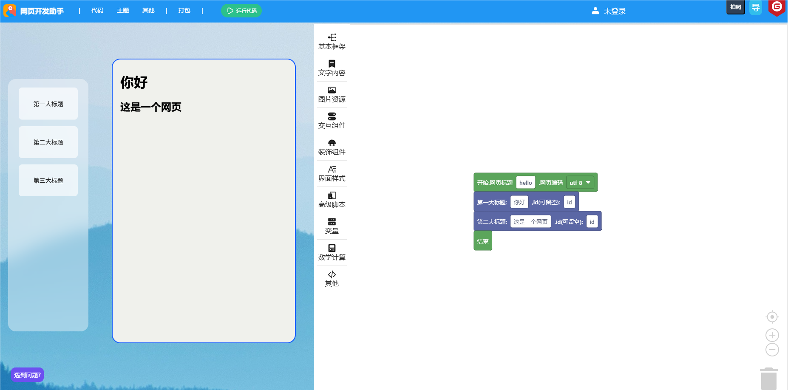

<h1 align="center">
  Woxy - website exploitation helper
</h1>

  <a href="README.md">中文</a> | <a href="README-EN.md">English</a>

  Help you develop web pages quickly, that there is no difficult web page in the world!

  
  
  

#### Notice

The update has been restored, and new features will be released during the summer vacation, so stay tuned!

#### Software architecture

Based on Google Blockly, using the jQuery framework, using the GPL3.0 open source license, please strictly abide by the relevant terms, we will reserve the right to pursue legal responsibility!

#### Install

1. Download the release (if it hasn't been updated for a long time, pull the master branch of the latest repository as the source code, and delete the `.git` directory)
2. Unzip to Server/Local
3. Visit 'index.html' to get started

#### Use

1. Drag and drop the bricks to program
2. Click "Run Code" to see the effect and then adjust it
3. Once you're done, click "Generate Code" and copy the code to an HTML file

#### Precautions

1. If you are using it for the first time or if you encounter any problems, please refer to the "Beginner's Guide", or add QQ group: 135452025
2. The tool is in the development stage, unfinished, and is currently only for beginners to learn, please do not use it in production! The production environment is complex and changeable, and various problems may arise, and I do not assume any responsibility!

#### Member

1. svipwing，Creator、Developers
2. CoolPlayLin，Developers
3. king2022，Developers
4. kezhixingchengxv，Instant game developers
5. Fgaoxing，UI designer、Developers
6. WA - Developers
7. zaona - UI designer
8. lokria - Developers
9. youming - Developers
10. zx - Developers

#### Github repo status

#### Get involved

1. Fork this repo
2. create a new branch
3. commit your code
4. create Pull Request