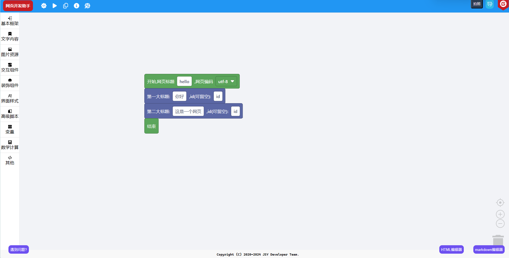

# 网页开发助手

#### 介绍

助你快速开发网页，让世界上没有难做的网页！

#### 软件架构

基于Google Blockly开发，使用jQuery框架，采用GPL3.0开源许可证，请严格遵守相关条款，我们将保留追究法律责任的权利！

#### 安装教程

1. 下载发行版
2. 解压到 服务器/虚拟主机（本地也行）
3. 访问`index.html`，开始使用

#### 使用说明

1. 拖拽积木进行编程
2. 点击“运行代码”，看看效果，然后再调整
3. 写完之后，点击“生成代码”，复制代码到HTML文件

#### 注意事项

1. 首次使用或遇到问题，请查看“新手指引”，或加q群：135452025
2. 该工具正在开发阶段，未完工，目前仅供初学者学习所用，请不要用于生产环境！生产环境复杂多变，可能出现各种问题，我不承担任何责任！

#### 贡献人员

1. 技术云，领导者、开发者
2. CoolPlayLin，管理员、开发者
3. king2022，开发者
4. 可执行程序，彩蛋开发者
5. Fgaoxing，界面UI设计、开发者

本仓库使用了jquery和bootstrap框架，markdown编辑器采用markdown.js、html2md.js，预览区截图采用html2canvas.js

#### github仓库状态

#### 参与贡献

1. Fork 本仓库
2. 新建 Feat_xxx 分支
3. 提交代码
4. 新建 Pull Request