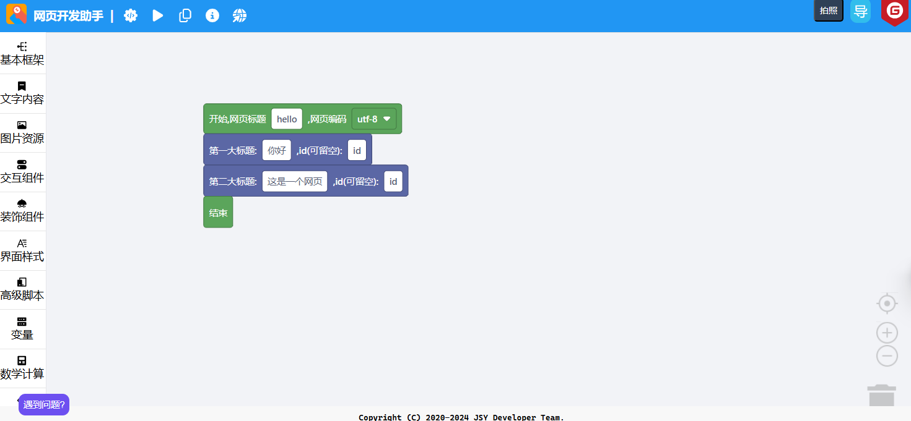

# 网页开发助手

<!--#### 公告

由于开发者学业原因，暂时暂停更新，预计 2024 年 7 月中旬恢复更新，感谢大家一直以来的支持！-->

### 目标

帮助我们的用户快速开发网页。

### 架构

本项目基于 Google Blockly 开发，本仓库使用了 jQuery 和 Bootstrap 框架，Markdown 编辑器采用了 markdown.js, html2md.js，预览区截图使用了 html2canvas.js。本项目采用 GPL 3.0 开源许可证，请严格遵守相关条款，我们将保留追究法律责任的权利。

#### 安装教程

1. 下载最新发行版（如果长期未更新，请拉取最新仓库的 master 分支作为源码，并删除 `.git` 目录）。
2. 解压到 服务器 / 虚拟主机 / 本地。
3. 访问 `index.html`，开始使用。

#### 使用说明

1. 拖拽积木进行编程
2. 点击“运行代码”，看看效果，然后再调整
3. 写完之后，点击“生成代码”，复制代码到HTML文件

#### 注意事项

1. 首次使用或遇到问题，请查看“新手指引”，或加入 QQ 交流群：135452025。
2. 该工具正在开发阶段，未完工，目前仅供初学者学习所用，请不要用于生产环境！生产环境复杂多变，对于出现的各种问题，我们并不承担任何责任。

#### 贡献人员

1. [技术云](https://github.com/svipwing)，领导者、开发者
2. CoolPlayLin，管理员、开发者
3. king2022，开发者
4. 可执行程序，彩蛋开发者
5. [Fgaoxing](https://github.com/Fgaoxing)，界面UI设计、开发者
6. [Lafcadia](https://github.com/Lafcadia)，Team OblivionOcean 社长，项目总监

#### 仓库状态

#### 参与贡献

1. Fork 本仓库
2. 新建 Feat_xxx 分支
3. 提交代码
4. 新建 Pull Request
